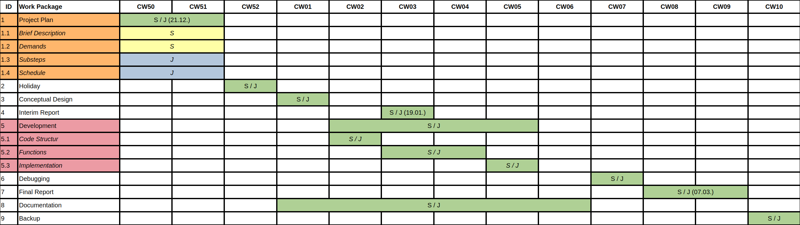

# Beat Detection

A project for SMP in Matlab.

## Brief Description

TODO

## Directory Structure

- [src/](./src/) contains all source code of the project.
- [docs/](./docs/) contains documentation written in LaTeX.
- [orga/](./orga/) contains documents about our internal organization.
- [assets/](./assets/) contains exported images and PDFs to be displayed on this page.

## Cloning

TODO

## Building

TODO

## Running

TODO

## Deadlines / Dates

Date | Appointment
---|---
2023-12-15 | Consultation Hour
2023-12-21 | Project Plan
2024-01-19 | Interim Report
2024-03-07 | Final Report

We hold a weekly meeting every Friday from 11 am to 3 pm.

### Gantt-Chart

