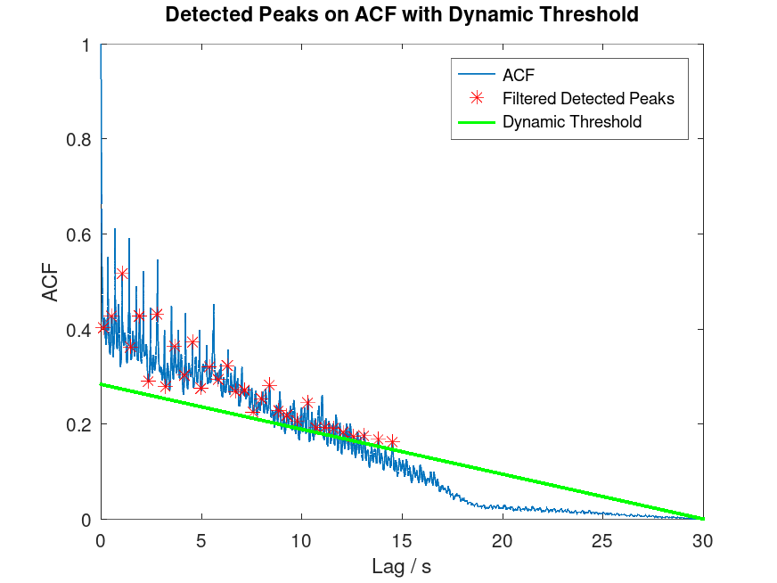

# Beat Detection

A project for SMP in Matlab.

## Directory Structure

- [src/](./src/) contains all source code of the project.
- [docs/](./docs/) contains documentation written in LaTeX.
- [assets/](./assets/) contains exported images and PDFs to be displayed on this page.

## Cloning

Clone using HTTPS:

```bash
git clone https://github.com/sid115/smp-project.git
```

## Running

Navigate to `smp-project/src/rhythmic_inside` and run:

```bash
octave main.m "/path/to/file.wav"
```

## Overview


## Analysis

Graphs are exported to [assets/plots/](./assets/plots).





The estimated BPM is printed in your CLI:

```bash
$ octave main.m "../../assets/techno.wav"

Estimated BPM: 147
```

Test in bulk with:

```bash
./testBulk.sh /path/to/wavs
```

## TODO

- high freq are not suitable for bpm detection. remove them from bpm analysis?
- peak detection: needs to be improved. threshold?
- spectogram
- docs
    - api?
    - plots
        - bpm array
        - how do we plot peaks in acf and energy now?
    - adjust statistical analysis
- presentation
    - slidev!

## Deadlines / Dates

Date | Appointment
---|---
2023-12-15 | Consultation Hour
2023-12-21 | Project Plan
2024-01-19 | Interim Report
2024-03-07 | Final Report

We hold a weekly meeting every Tuesday from 11 am to 3 pm.
